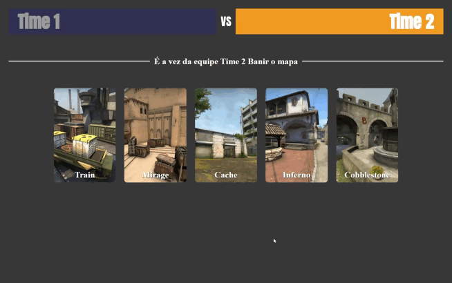
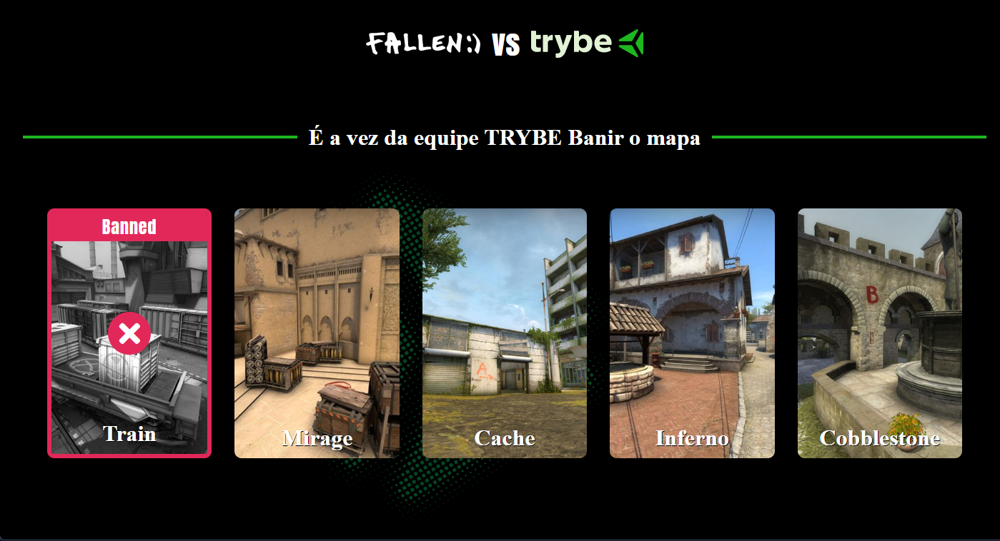

<h1 align="center">Pick'N Ban</h1>

Interface de seleção para banimento de mapas em uma partida de CS:GO, baseado no programa Primeiros Passos na Programação promovido pela <a href="https://www.betrybe.com/">Trybe</a>.

  <a href="#-tecnologias">Tecnologias Usadas</a>&nbsp;&nbsp;&nbsp;|&nbsp;&nbsp;&nbsp;
  <a href="#-projeto">Sobre o Projeto</a>&nbsp;&nbsp;&nbsp;|&nbsp;&nbsp;&nbsp;
  <a href="#-layout">Sobre o Layout</a>&nbsp;&nbsp;&nbsp;|&nbsp;&nbsp;&nbsp;

 

  

## 🚀 Tecnologias

Esse projeto foi desenvolvido com as seguintes tecnologias:

- HTML e CSS
- JavaScript
- Git e Github

## 💻 Projeto

Essa webpage simula a interface presente em jogos como Rainbow Six: Siege e o próprio CS:GO (exemplo usado neste projeto), sob o objetivo de eleger o mapa da partida através da eliminação ou banimento dos mapas indesejados pelas ambas equipes presentes na partida.

## 🔖 Layout

O layout do projeto é baseado no seguinte modelo proposto inicialmente pelo evento:

  

